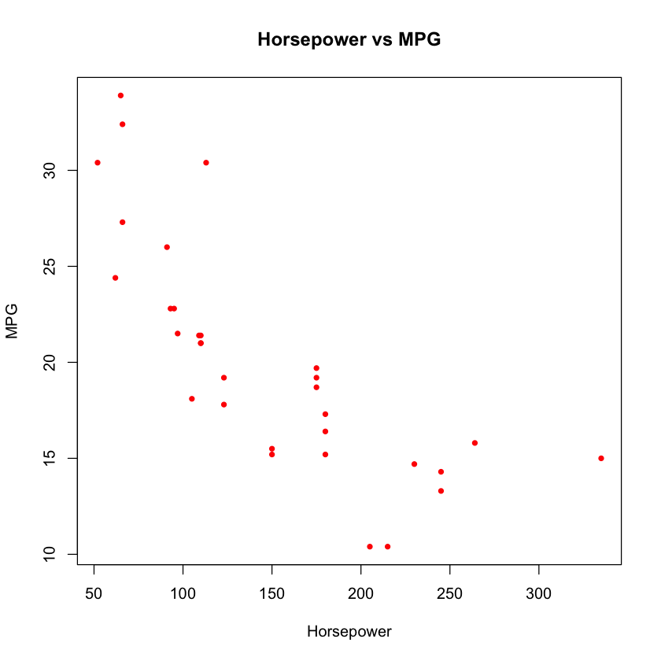
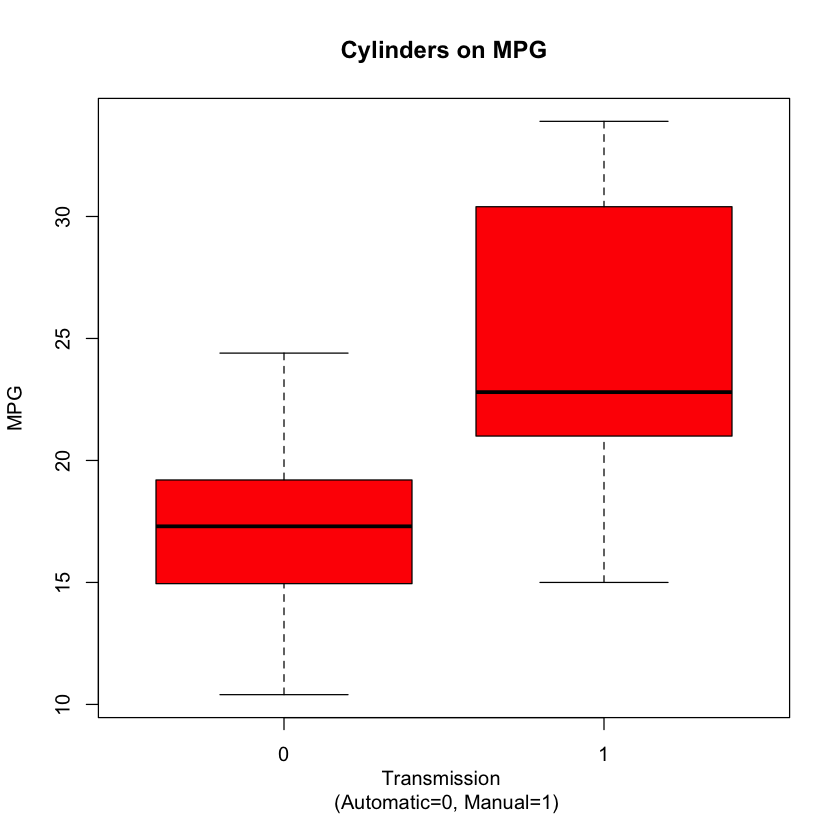
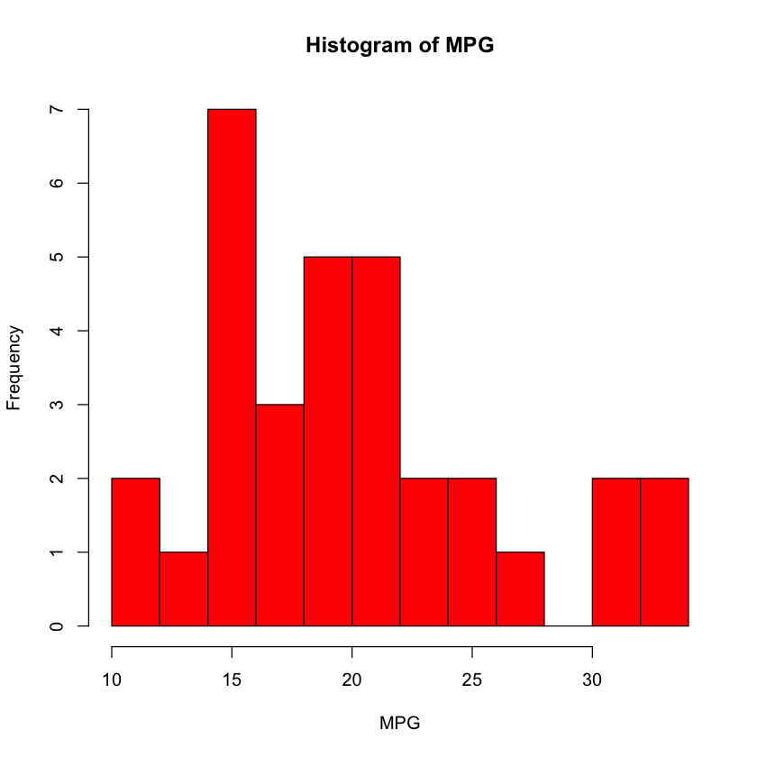

# Fuel Efficiency Analysis

## Load the data


```R
# The mtcars dataset is part of the base R distribution. So we don't have to load it.
# get the help
?mtcars
```


<table width="100%" summary="page for mtcars {datasets}"><tr><td>mtcars {datasets}</td><td style="text-align: right;">R Documentation</td></tr></table>

<h2>Motor Trend Car Road Tests</h2>

<h3>Description</h3>

<p>The data was extracted from the 1974 <em>Motor Trend</em> US magazine,
and comprises fuel consumption and 10 aspects of
automobile design and performance for 32 automobiles (1973&ndash;74
models).
</p>


<h3>Usage</h3>

<pre>mtcars</pre>


<h3>Format</h3>

<p>A data frame with 32 observations on 11 (numeric) variables.
</p>

<table summary="Rd table">
<tr>
 <td style="text-align: right;">
    [, 1] </td><td style="text-align: left;"> mpg  </td><td style="text-align: left;"> Miles/(US) gallon </td>
</tr>
<tr>
 <td style="text-align: right;">
    [, 2] </td><td style="text-align: left;"> cyl  </td><td style="text-align: left;"> Number of cylinders </td>
</tr>
<tr>
 <td style="text-align: right;">
    [, 3] </td><td style="text-align: left;"> disp </td><td style="text-align: left;"> Displacement (cu.in.) </td>
</tr>
<tr>
 <td style="text-align: right;">
    [, 4] </td><td style="text-align: left;"> hp   </td><td style="text-align: left;"> Gross horsepower </td>
</tr>
<tr>
 <td style="text-align: right;">
    [, 5] </td><td style="text-align: left;"> drat </td><td style="text-align: left;"> Rear axle ratio </td>
</tr>
<tr>
 <td style="text-align: right;">
    [, 6] </td><td style="text-align: left;"> wt   </td><td style="text-align: left;"> Weight (1000 lbs) </td>
</tr>
<tr>
 <td style="text-align: right;">
    [, 7] </td><td style="text-align: left;"> qsec </td><td style="text-align: left;"> 1/4 mile time </td>
</tr>
<tr>
 <td style="text-align: right;">
    [, 8] </td><td style="text-align: left;"> vs   </td><td style="text-align: left;"> Engine (0 = V-shaped, 1 = straight) </td>
</tr>
<tr>
 <td style="text-align: right;">
    [, 9] </td><td style="text-align: left;"> am   </td><td style="text-align: left;"> Transmission (0 = automatic, 1 = manual) </td>
</tr>
<tr>
 <td style="text-align: right;">
    [,10] </td><td style="text-align: left;"> gear </td><td style="text-align: left;"> Number of forward gears </td>
</tr>
<tr>
 <td style="text-align: right;">
    [,11] </td><td style="text-align: left;"> carb </td><td style="text-align: left;"> Number of carburetors
  </td>
</tr>

</table>


<h3>Source</h3>

<p>Henderson and Velleman (1981),
Building multiple regression models interactively.
<em>Biometrics</em>, <b>37</b>, 391&ndash;411.
</p>


<h3>Examples</h3>

<pre>
require(graphics)
pairs(mtcars, main = "mtcars data", gap = 1/4)
coplot(mpg ~ disp | as.factor(cyl), data = mtcars,
       panel = panel.smooth, rows = 1)
## possibly more meaningful, e.g., for summary() or bivariate plots:
mtcars2 &lt;- within(mtcars, {
   vs &lt;- factor(vs, labels = c("V", "S"))
   am &lt;- factor(am, labels = c("automatic", "manual"))
   cyl  &lt;- ordered(cyl)
   gear &lt;- ordered(gear)
   carb &lt;- ordered(carb)
})
summary(mtcars2)
</pre>

<hr /><div style="text-align: center;">[Package <em>datasets</em> version 3.5.1 ]</div>


```R
# see all of the variable names
names(mtcars)
```


<ol class=list-inline>
	<li>'mpg'</li>
	<li>'cyl'</li>
	<li>'disp'</li>
	<li>'hp'</li>
	<li>'drat'</li>
	<li>'wt'</li>
	<li>'qsec'</li>
	<li>'vs'</li>
	<li>'am'</li>
	<li>'gear'</li>
	<li>'carb'</li>
</ol>


```R
# see the first 6 observations
head(mtcars)
```


<table>
<thead><tr><th></th><th scope=col>mpg</th><th scope=col>cyl</th><th scope=col>disp</th><th scope=col>hp</th><th scope=col>drat</th><th scope=col>wt</th><th scope=col>qsec</th><th scope=col>vs</th><th scope=col>am</th><th scope=col>gear</th><th scope=col>carb</th></tr></thead>
<tbody>
	<tr><th scope=row>Mazda RX4</th><td>21.0 </td><td>6    </td><td>160  </td><td>110  </td><td>3.90 </td><td>2.620</td><td>16.46</td><td>0    </td><td>1    </td><td>4    </td><td>4    </td></tr>
	<tr><th scope=row>Mazda RX4 Wag</th><td>21.0 </td><td>6    </td><td>160  </td><td>110  </td><td>3.90 </td><td>2.875</td><td>17.02</td><td>0    </td><td>1    </td><td>4    </td><td>4    </td></tr>
	<tr><th scope=row>Datsun 710</th><td>22.8 </td><td>4    </td><td>108  </td><td> 93  </td><td>3.85 </td><td>2.320</td><td>18.61</td><td>1    </td><td>1    </td><td>4    </td><td>1    </td></tr>
	<tr><th scope=row>Hornet 4 Drive</th><td>21.4 </td><td>6    </td><td>258  </td><td>110  </td><td>3.08 </td><td>3.215</td><td>19.44</td><td>1    </td><td>0    </td><td>3    </td><td>1    </td></tr>
	<tr><th scope=row>Hornet Sportabout</th><td>18.7 </td><td>8    </td><td>360  </td><td>175  </td><td>3.15 </td><td>3.440</td><td>17.02</td><td>0    </td><td>0    </td><td>3    </td><td>2    </td></tr>
	<tr><th scope=row>Valiant</th><td>18.1 </td><td>6    </td><td>225  </td><td>105  </td><td>2.76 </td><td>3.460</td><td>20.22</td><td>1    </td><td>0    </td><td>3    </td><td>1    </td></tr>
</tbody>
</table>


```R
# write the data.frame to a csv
write.csv(mtcars, "mtcars.csv")
```


```R
# read in the data from the csv and show the first 6 observations
cars = read.csv("mtcars.csv")
head(cars)
```


<table>
<thead><tr><th scope=col>X</th><th scope=col>mpg</th><th scope=col>cyl</th><th scope=col>disp</th><th scope=col>hp</th><th scope=col>drat</th><th scope=col>wt</th><th scope=col>qsec</th><th scope=col>vs</th><th scope=col>am</th><th scope=col>gear</th><th scope=col>carb</th></tr></thead>
<tbody>
	<tr><td>Mazda RX4        </td><td>21.0             </td><td>6                </td><td>160              </td><td>110              </td><td>3.90             </td><td>2.620            </td><td>16.46            </td><td>0                </td><td>1                </td><td>4                </td><td>4                </td></tr>
	<tr><td>Mazda RX4 Wag    </td><td>21.0             </td><td>6                </td><td>160              </td><td>110              </td><td>3.90             </td><td>2.875            </td><td>17.02            </td><td>0                </td><td>1                </td><td>4                </td><td>4                </td></tr>
	<tr><td>Datsun 710       </td><td>22.8             </td><td>4                </td><td>108              </td><td> 93              </td><td>3.85             </td><td>2.320            </td><td>18.61            </td><td>1                </td><td>1                </td><td>4                </td><td>1                </td></tr>
	<tr><td>Hornet 4 Drive   </td><td>21.4             </td><td>6                </td><td>258              </td><td>110              </td><td>3.08             </td><td>3.215            </td><td>19.44            </td><td>1                </td><td>0                </td><td>3                </td><td>1                </td></tr>
	<tr><td>Hornet Sportabout</td><td>18.7             </td><td>8                </td><td>360              </td><td>175              </td><td>3.15             </td><td>3.440            </td><td>17.02            </td><td>0                </td><td>0                </td><td>3                </td><td>2                </td></tr>
	<tr><td>Valiant          </td><td>18.1             </td><td>6                </td><td>225              </td><td>105              </td><td>2.76             </td><td>3.460            </td><td>20.22            </td><td>1                </td><td>0                </td><td>3                </td><td>1                </td></tr>
</tbody>
</table>


## Plotting (Instructor)


```R
# scatter plot of horsepower on miles per gallon
plot(
    mtcars$hp,
    mtcars$mpg,
    col="red",
    main="Horsepower vs MPG",
    xlab="Horsepower",
    ylab="MPG",
    pch=20
)
```





```R
# make a box plot of mpg by transmission
boxplot(
    mpg ~ am,
    data=mtcars,
    col="red",
    xlab="Transmission \n (Automatic=0, Manual=1)",
    ylab="MPG",
    main = "Cylinders on MPG"
)
```





```R
# make a histogram for MPG
hist(
    mtcars$mpg,
    breaks=10,
    col="red",
    xlab="MPG",
    main="Histogram of MPG",
)
```





```R
# automatically plot everything in the data.frame
plot(mtcars)
```


```R
# loop over names
for (name in names(mtcars)){
    print(name)
}
```

    [1] "mpg"
    [1] "cyl"
    [1] "disp"
    [1] "hp"
    [1] "drat"
    [1] "wt"
    [1] "qsec"
    [1] "vs"
    [1] "am"
    [1] "gear"
    [1] "carb"
    
